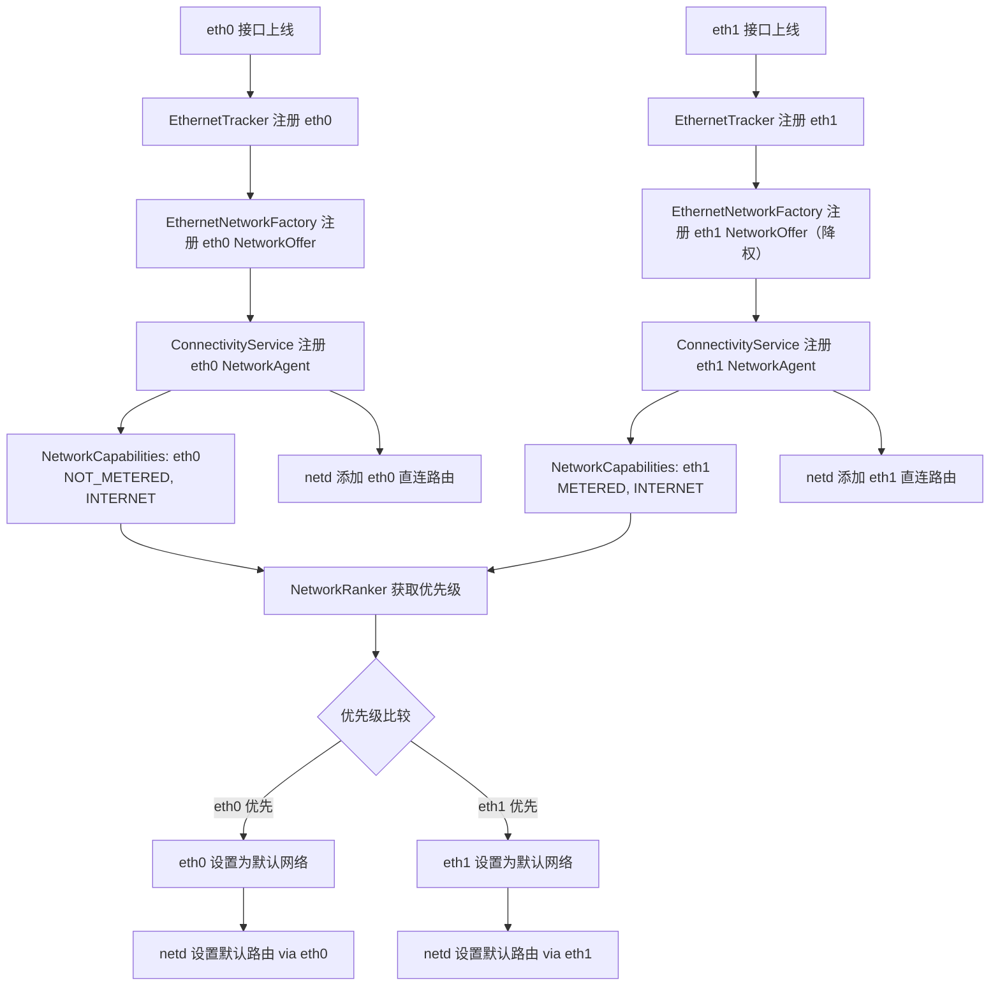

[配置内部以太网](https://source.android.com/docs/automotive/connectivity/ethernet-manage?hl=zh-cn)

## Android 12 对比 14 在多以太网差异

Android 14 确实在框架层面更好地处理了多个以太网接口的并行工作，尤其是在 Automotive OS 的推动下，对多网卡的支持成为了核心需求。

| 项目                           | Android 12                                   | Android 14                                                |
|--------------------------------|----------------------------------------------|------------------------------------------------------------|
| 🌐 多以太网接口支持            | ⚠️ 初步支持，仅 eth0 稳定；eth1 需定制      | ✅ 原生支持多接口，eth0/eth1 并行                          |
| ⚙️ 接口识别机制                | 仅支持 `config_ethernet_iface_regex`         | ✅ 支持 `config_ethernet_interfaces` 精确控制              |
| 🔌 接口注册机制                | 默认只注册第一个接口                         | ✅ 每个接口都通过 `NetworkOffer` 注册                      |
| 📶 NetworkAgent 支持           | 仅 eth0 被注册为 NetworkAgent               | ✅ eth0 和 eth1 均注册为独立 NetworkAgent                  |
| 📊 网络能力判定                | 固定能力集合，优先级不可控                  | ✅ 可配置能力（如 NOT_METERED）以调整优先级               |
| 📈 网络优先级控制              | ❌ 固定优先级顺序                            | ✅ 可通过 `persist.net.preferred.transports.order` 配置    |
| 🔄 Failover 自动切换           | ❌ 无法自动切换                              | ✅ 支持网络断线自动切换                                   |
| 🔐 路由稳定性与多网支持        | ❌ 多接口路由易冲突                          | ✅ netd 添加低优先级 rule 避免路由丢失                    |
| 🧠 常驻连接策略                | ❌ 无机制                                     | ✅ 支持 `ethernet_always_requested` 设置                   |
| 🛠️ 设置可控性                 | 仅可通过修改源码实现                        | ✅ 可通过 adb settings 和 SystemProperties 控制             |
| 🚗 Automotive 多域网络支持     | ❌ 无现成支持                                | ✅ 与 Automotive 框架集成，支持域分离（如 IVI/TCU）         |
| 💡 Overlay 灵活性              | 配置点少，需改 framework                     | ✅ 支持多个 config_xxx，便于产品差异化                     |

## android 14 源码

rk3576_android_14/packages/modules/Connectivity/service-t/src/com/android/server/ethernet

```bash

.
├── EthernetCallback.java
├── EthernetConfigStore.java
├── EthernetNetworkAgent.java
├── EthernetNetworkFactory.java
├── EthernetServiceImpl.java
├── EthernetService.java
└── EthernetTracker.java

```

## 补丁实现原理

1. Kernel：eth1 接口由驱动层创建，如 USB 网卡或 MAC1 启用；
2. EthernetTracker：系统监测到 eth1 接口上线，触发注册流程；
3. EthernetNetworkFactory：通过 registerNetworkOffer() 注册 eth1 网络能力；
4. ConnectivityService：接受 NetworkAgent 注册，构建 NetworkAgentInfo 实例；
5. NetworkAgentInfo：表示 eth1 成为系统中的一个活跃网络；
6. NetworkRanker：系统根据你配置的优先级（如 Ethernet > WiFi）决定 eth1 是否为默认；
7. RouteController (netd)：添加路由规则，防止 eth1 的网关丢失或路由冲突。

### eth0 与 eth1 并存时的系统路由选择流程图



* eth0 一般具有更高优先级，因为它带有 NOT_METERED，系统认为它是免费/主链路；
* eth1 被补丁刻意降级（去掉 NOT_METERED），系统会优先选择 eth0 为默认；
* 即便如此，eth1 仍注册为 NetworkAgent，可用于 failover、或特定请求；
* netd 会为两个接口都添加 addDirectlyConnectedRule，避免路由冲突或丢失。

#### EthernetNetworkFactory.java

在注册 NetworkOffer 时，如果接口名是 eth1，就降权处理, 让系统识别 eth1 是次要网络，不抢占默认路由；但又注册为可用网络

```java

        private void registerNetworkOffer() {
            // If mNetworkOfferCallback is already set, it should be reused to update the existing
            // offer.
            if (mNetworkOfferCallback == null) {
                mNetworkOfferCallback = new EthernetNetworkOfferCallback();
            }

            //lixiaogang add start
            if(name != null && name.equals("eth1")) {
                //mCapabilities.removeCapability(NetworkCapabilities.NET_CAPABILITY_INTERNET);
                mCapabilities.removeCapability(NetworkCapabilities.NET_CAPABILITY_NOT_METERED);
                //mCapabilities.removeCapability(NetworkCapabilities.NET_CAPABILITY_NOT_VPN);
                Log.d(TAG, "hcq mCapabilities: " + mCapabilities);
            }
            //lixiaogang add end

            mNetworkProvider.registerNetworkOffer(getNetworkScore(),
                    new NetworkCapabilities(mCapabilities), cmd -> mHandler.post(cmd),
                    mNetworkOfferCallback);
        }

```

#### ConnectivityService.java

强制注册并激活以太网 eth1 的连接请求

```java

    private void handleConfigureAlwaysOnNetworks() {
        handleAlwaysOnNetworkRequest(mDefaultMobileDataRequest,
                ConnectivitySettingsManager.MOBILE_DATA_ALWAYS_ON, true /* defaultValue */);
        //modify defaultValue to true by lixiaogang
        handleAlwaysOnNetworkRequest(mDefaultWifiRequest,
                ConnectivitySettingsManager.WIFI_ALWAYS_REQUESTED, true /* defaultValue */);
        final boolean vehicleAlwaysRequested = mResources.get().getBoolean(
                R.bool.config_vehicleInternalNetworkAlwaysRequested);
        handleAlwaysOnNetworkRequest(mDefaultVehicleRequest, vehicleAlwaysRequested);

        //lixiaogang add start
        handleAlwaysOnNetworkRequest(mDefaultEthernetRequest,
                ConnectivitySettingsManager.ETHERNET_ALWAYS_REQUESTED, true /* defaultValue */);

        handleAlwaysOnNetworkRequest(mDefaultEthernetRequest,
                ConnectivitySettingsManager.BLUETOOTH_ALWAYS_REQUESTED, true /* defaultValue */);
        //lixiaogang add end
    }

    // 意图：避免系统主动断开 eth 网络连接（尤其是 eth1）
    private void teardownUnneededNetwork(NetworkAgentInfo nai) {
        if (nai.numRequestNetworkRequests() != 0) {
            for (int i = 0; i < nai.numNetworkRequests(); i++) {
                NetworkRequest nr = nai.requestAt(i);
                // Ignore listening and track default requests.
                if (!nr.isRequest()) continue;
                loge("Dead network still had at least " + nr);
                break;
            }
        }
        // delete by lixiaogang start
        // nai.disconnect();
        // delete by lixiaogang end
    }

```

#### RouteController.cpp

注册一条低优先级 IP rule，用于查找主路由表中直连网关地址，避免多个接口存在时路由冲突。

```cpp

constexpr int32_t RULE_PRIORITY_DIRECTLY_CONNECTED                = 9999;


int RouteController::Init(unsigned localNetId) {
    if (int ret = flushRules()) {
        return ret;
    }
    if (int ret = addLegacyRouteRules()) {
        return ret;
    }
    if (int ret = addLocalNetworkRules(localNetId)) {
        return ret;
    }
    //lixiaogang add start
    if (int ret = addDirectlyConnectedRule()) {
       return ret;
    }
    //lixiaogang add end
    if (int ret = addUnreachableRule()) {
        return ret;
    }
    // Don't complain if we can't add the dummy network, since not all devices support it.
    configureDummyNetwork();

    updateTableNamesFile();
    return 0;
}

```


